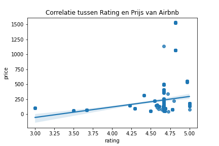
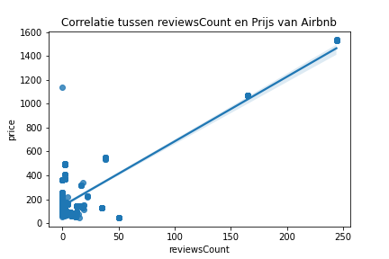
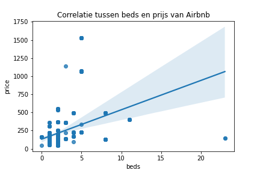
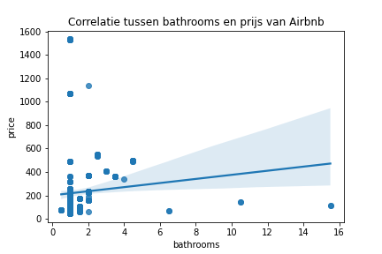
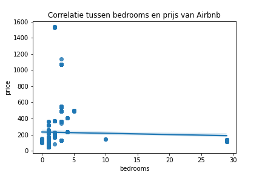
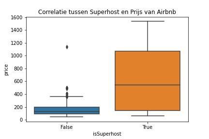
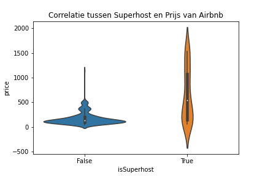

# Mijn Data Analyse Document

Dit document bevat analyses en grafieken die zijn gegenereerd met behulp van Python.

### Linear Relations

## Correlatie tussen Rating en Prijs van Airbnb

R² = {{cor_rating}}

## Correlatie tussen reviewsCount en Prijs van Airbnb

R² = {{cor_review}}

## Correlatie tussen beds en Prijs van Airbnb

R² = {{cor_beds}}

## Correlatie tussen bathrooms en Prijs van Airbnb

R² = {{cor_bathrooms}}

## Correlatie tussen bedrooms en Prijs van Airbnb

R² = {{cor_bedrooms}}

## Correlatie tussen Superhost en Prijs van Airbnb

Hier is een boxplot en een violinplot die de correlatie tussen Superhost en Prijs laten zien:

T-test resultaat:
pvalue = {{superhost_ttest}}

## Timestamp

Dit document is gegenereerd op {{TIMESTAMP}}.
